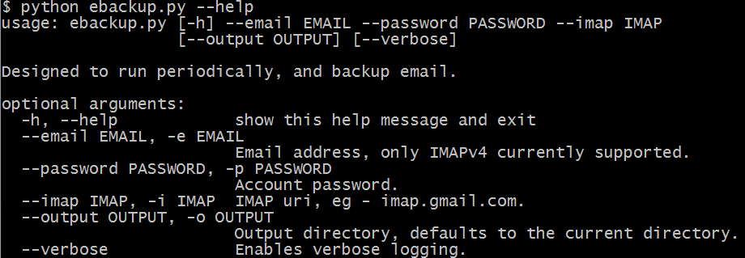
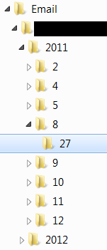
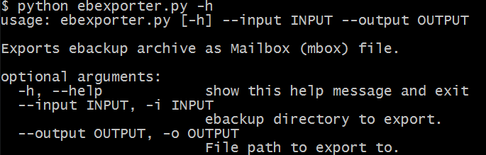

email-backup
=

A set of simple scripts to manage email backup. These two scripts are designed to run periodically as services.

Overview
=

There are two main scripts for backing up email.

`ebackup.py`, downloads a copy of new messages into a simple folder hierarchy with flat files.

`ebexporter.py` can be used to create a single `.mbox` file and a compressed archive from this folder structure. 

ebackup.py
=

`ebackup` supports any host with `IMAPv4` access.

The script will download only new messages by keeping track locally of which messages it has already downloaded. It does not use imap `FLAGS` to get around various issues with different imap providers.

Each message will be written to a distinct flat file. The directory structure is `[year]/[month]/[day]/[hour].[minute].[second].message`.

ebexporter.py
=

`ebexporter` is useful to compile all emails into a single `.mbox` file, which compresses nicely.

The exporter accepts a directory output from `ebackup`, and compiles the messages into an ordered `Mailbox` file. It also outputs a compressed (zip) archive.