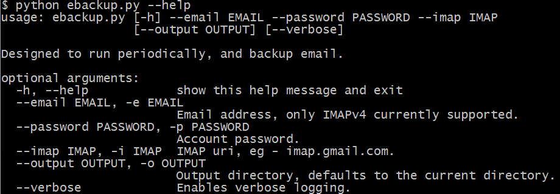
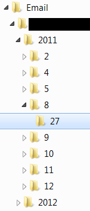
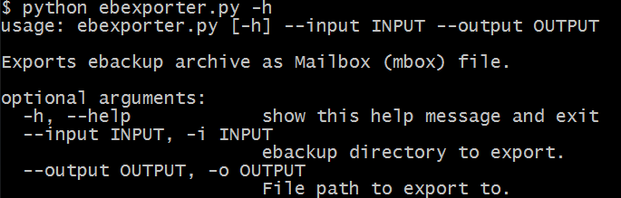
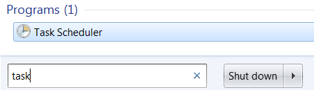
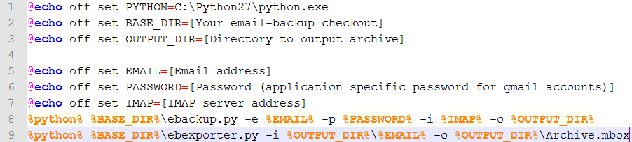

email-backup
=

A set of simple scripts to manage email backup for any server supporting `IMAP v4`. These two scripts are designed to run periodically as services.

To use with **Gmail**, you will need to setup an [**application specific password**](https://support.google.com/mail/answer/1173270?hl=en).

Quickstart
=

* Checkout repo.
* Requires Python (tested on 2.7.6).
* Requires `imaplib`, `email`, and `zipfile` among other Python libs. Usually these are installed by default.
* Run `python ebackup.py -o . -e YOUR_EMAIL -p YOUR_PASSWORD -i IMAP_SERVER`.
	* For Gmail users:
		* Create an [**application specific password**](https://support.google.com/mail/answer/1173270?hl=en).
		* `IMAP_SERVER` will be imap.gmail.com.
* Once the command finishes, you should see a directory named `YOUR_EMAIL` in the current directory. This is your archive.

Motivation
=

**I wanted something simple**. I don't want hardware, I don't want to pay, I don't want a web service, I don't want an app for my phone-- I want 100 lines of easy-to-read, easy-to-debug code.

This particular solution can be easily used with any backup solution. I use a local external backup drive and SpiderOak (which I highly recommend). Zero-knowledge remote backup is, I think, a pretty big deal.

Overview
=

There are two main scripts for backing up email.

`ebackup.py`, downloads a copy of new messages into a simple folder hierarchy with flat files.

`ebexporter.py` can be used to create a single `.mbox` file and a compressed archive from this folder structure. 

ebackup.py
=

`ebackup` supports any host with `IMAPv4` access.

The script will download only new messages by keeping track locally of which messages it has already downloaded. It does not use imap `FLAGS` to get around various issues with different imap providers.

Each message will be written to a distinct flat file. The directory structure is `[year]/[month]/[day]/[hour].[minute].[second].message`.

ebexporter.py
=

`ebexporter` is useful to compile all emails into a single `.mbox` file, which compresses nicely.

The exporter accepts a directory output from `ebackup`, and compiles the messages into an ordered `Mailbox` file. It also outputs a compressed (zip) archive.

How to install as scheduled task on Windows
=

These scripts should be run periodically. On Linux and Unix, users can set up scheduled tasks in a variety of ways. On Windows, you can use **Scheduled Tasks**.

**1.** Open Task Scheduler.

**2.** Copy `ebtask_example.bat` to `ebtask.bat` (which is already ignored by the `.gitignore`).

**3.** Fill in various variables.

**4.** In Task Scheduler, schedule `ebtask.bat` to run on whatever schedule you choose.

But why doesn't...
=

**...`ebackup` just add new messages to a single `mbox` file to begin with?** Because a giant `mbox` file is harder to work with. You would have to parse the whole file to do simple queries (where are my emails from December?). You could not peruse and open messages easily. Because this is simpler.

**...`ebackup` use `FLAGS`?** `FLAGS` are not something my little python script has complete control over.

**...something else?** If you have a suggestion, I'd love to hear it.